# The Goal and Result
This is a GPU-driven particle system built in C++ and DirectX 11, utilizing compute shaders with indirect dispatch and indirect draw call.

The result shows that with more than 1 million particles, only 2 dispatch and 1 draw call is used, and it runs 60 FPS on a machine with GTX 1080 and i7-8700K.
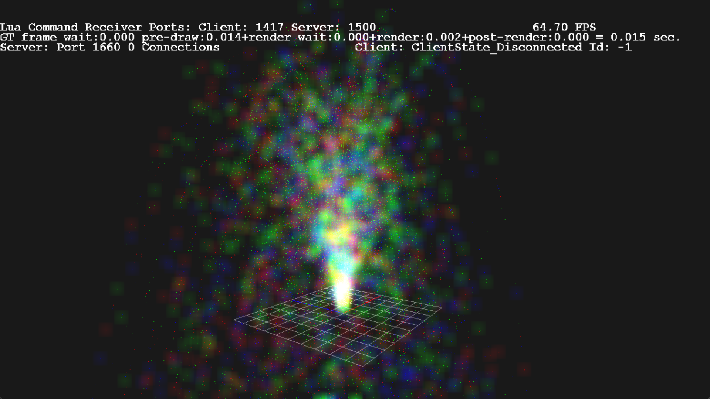

# Resources Setup
## Particle Emitter Buffer
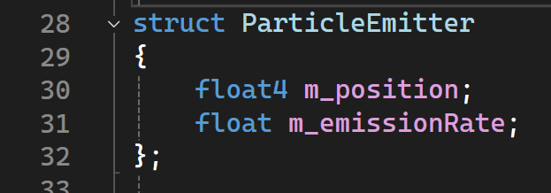\
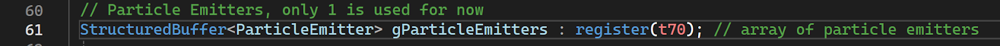\
Particle emitters are defined in one structured buffer with 2 simple properties of position and emissionRate.

## Particle Buffers
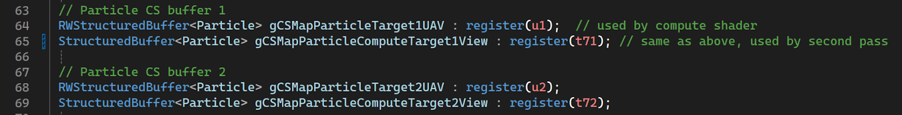\
To avoid fragmentation, 2 particle buffers are created to do flip flop operation, each one has a UAV and a SRV used by compute shader and vertex shader respectively.

On the CPU side, there’s also a particle definition used to initialize buffers.
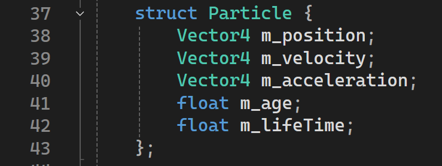

When the engine starts, two buffers will be created with initial data of age equals -1.0, indicating that the particle is not active.

## Indirect Draw Buffer
Because all particles are drawn in one draw call using indirect draw, an indirect draw argument buffer is needed. It has the type of RWByteAddressBuffer and mics flags of D3D11_RESOURCE_MISC_DRAWINDIRECT_ARGS | D3D11_RESOURCE_MISC_BUFFER_ALLOW_RAW_VIEWS to allow using as draw arguments and performing InterlockedAdd atomic instruction.\
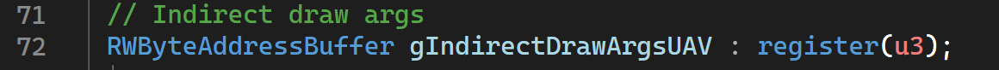

## Indirect Dispatch Buffer
The number of active particles can vary from frame to frame, and one thread group can only have a max of 1024 threads. Therefore we need an indirect dispatch where the number of groups is determined by another compute shader. In this case, it’s determined by adding the particle count last frame with new particle count this frame. The setup of this buffer and shader view is similar to the indirect draw buffer.\
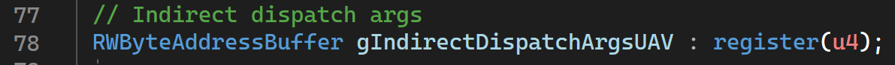

# Pipeline Setup
The pipeline consists of 2 dispatches and 1 indirect draw call, they are separated into 3 effects(shader combination group) in a single render group.\
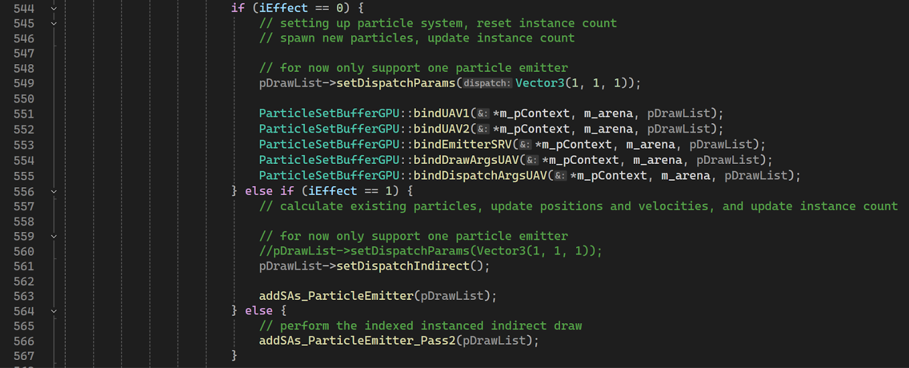

On the first dispatch, the instance count of the draw call buffer will be resetted. New particles emitted will be added to the particle buffer. Instance count will be updated accordingly.

Then the indirect dispatch argument will be updated so the next compute pass has enough groups for all active particles.\
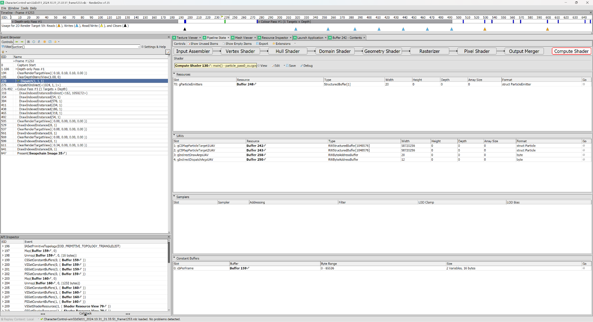

On the second dispatch, all existing particles will be updated from one buffer to another, particles that are inactive or become inactive will be ignored. The instance count will also be increased.\
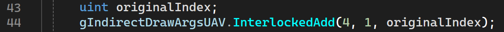

After this update, all active particles will live in index 0 to n, and the draw argument instance count will be n, where n is the number of active particles. An example particle buffer is shown below, note that new spawned particles will have age of 0.01, in this frame 3500 particles were spawned.\
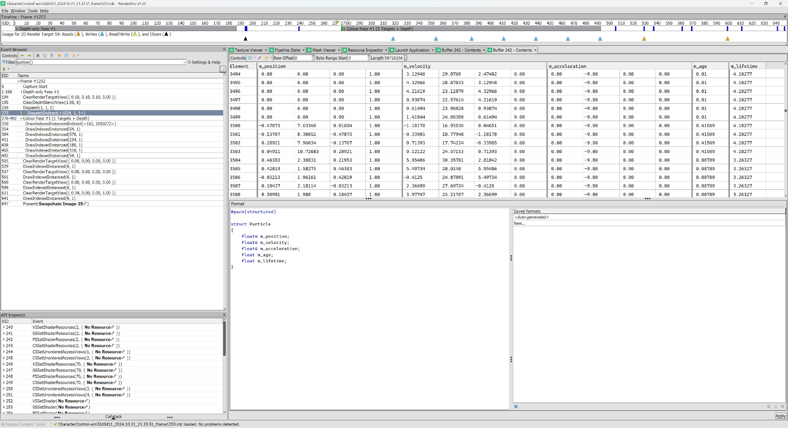

Finally when particles are ready to be draw, an indexed instanced indirect draw call will be performed.\
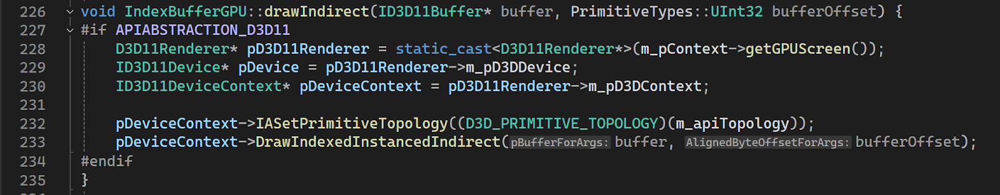

Another set of shaders are created that can index into the particle buffer using instance id and then change the vertex position. Following image shows drawing all particle instances at one draw call.\
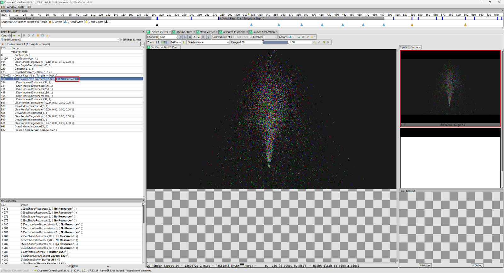

# Performance
Comparing before and after adding the particle system, it has a minimal impact on the performance, running smoothly at 60 FPS on a machine with GTX 1080 and i7-8700K.\
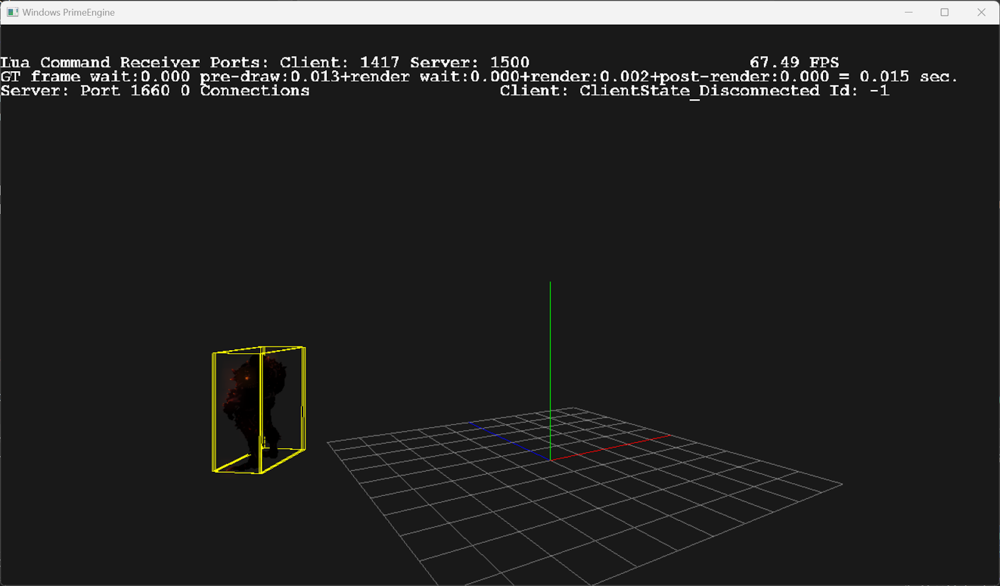
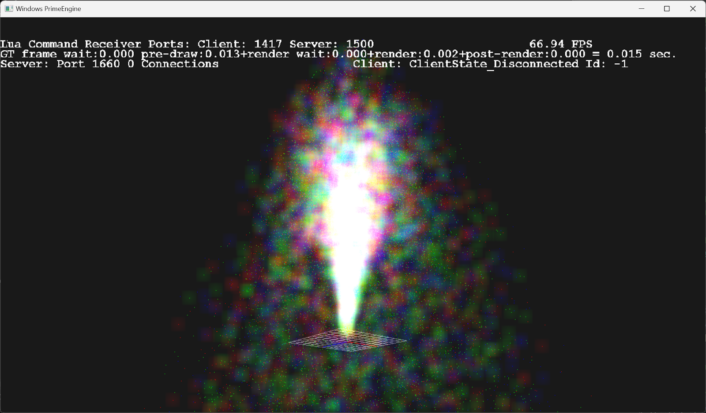

The task manager also shows that the program takes most power from GPU while keep CPU mostly free.\
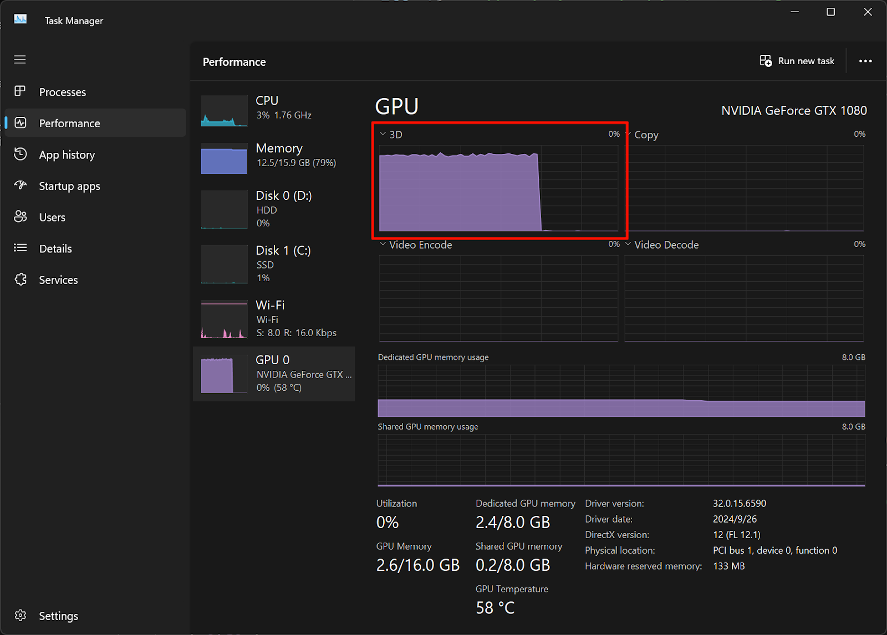
